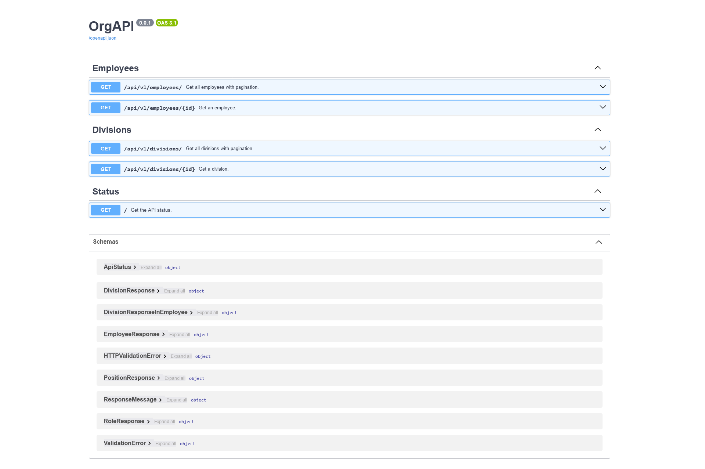

## Technology Stack

- ⚡ [**FastAPI**](https://fastapi.tiangolo.com) for the Python backend API.
    - 🧰 [SQLModel](https://sqlmodel.tiangolo.com) for the Python SQL database interactions (ORM).
    - 🔍 [Pydantic](https://docs.pydantic.dev), used by FastAPI, for the data validation and settings management.
    - 💾 [PostgreSQL](https://www.postgresql.org) as the SQL database.
- 🐋 [Docker Compose](https://www.docker.com) for development and production.

### Interactive API Documentation



## Project structure
```
src
├── alembic/ # database migrations
├── scripts/ # docker scripts
├── csv_data/ # initial data to load
├── OrgAPI  # FastAPI app
│   ├── routers/          # API endpoints
│   ├── config.py         # app settings
│   ├── crud.py           # classes for CRUD operations
│   ├── database.py       # database sessions management
│   ├── dependencies.py   # dependency injections
│   ├── models.py         # pydantic and db models
│   └── server.py         # initializes the FastAPI app
├── tests/                # unit tests
├── main.py               # root of the project, which runs the app
├── Makefile              # project build/test instructions
├── pytest.ini            # pytest configuration
├── requirements_test.txt # additional requirements for testing (pytest)
├── requirements.txt      # app requirements
├── docker-compose.yml    # docker compose config
├── Dockerfile            # docker base image
├── .env                  # environment variables to configure the app
├── .env_test             # environment variables to configure tests
└── alembic.ini           # alembic config
```

## To run the API, please follow these steps:

### First, make sure:
- you have Docker installed
- you are in the src/ folder

### Create .env files with:

```
make env-files
```

This will create `.env` and `.env_test` files.

The `.env` file contains the minimal set of environment variables for the API configuration. It has `DB_PASSWORD` (required) and `DB_PORT` (optional) variables. The `DB_PORT` variable is set to `5233` in case you have the standard `5232` port in use (because it will be exposed from the Docker container to make the database accessible for checks).
You can change it to whatever you want.

The `.env_test` file contains only the `DB_PASSWORD` (required) variable. It's used by the tests. The test container doesn't expose the database port.

### Run the API locally on port 8000 using:

```
make
```

### Check that the API is running:

Go to http://localhost:8000 in your browser, you should see the API name, version and status there.

### Use the Swagger UI to explore the API:

Go to http://localhost:8000/swagger in your browser. You can see the API in detail there.